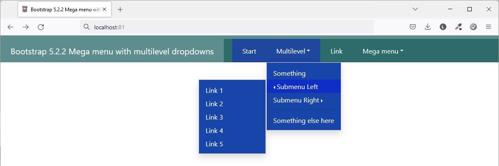
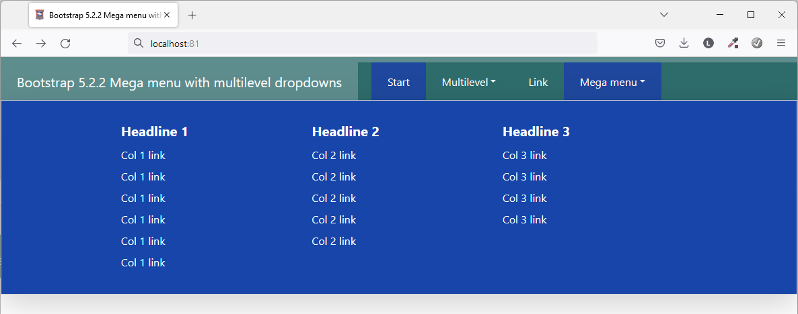
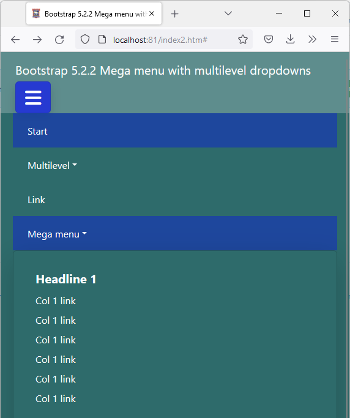

# Bootstrap 5.2.2 Mega menu with multilevel dropdowns   

This is a menu that can be used in Bootstrap 5. It supports multilevel dropdowns and columns on submenus. Dropdowns can be configured to expand right or left.

The font awesome css was included but it's only functionality is to add a hamburger icon.

This has been tested in Bootstrap 5.2.2. 


## Authors

- [@lasseedsvik](https://www.github.com/lasseedsvik)


## Demo

https://jsfiddle.net/lasseedsvik/7socxqdz

## Screenshots

**Multi-level dropdown**



**Menus in columns**


**Small menu**




## Usage

**For left dropdown**

```HTML
...
<ul class="dropdown-menu mt-0">
    <li class="dropstart">
        <a href="#" class="dropdown-item dropdown-toggle" data-bs-toggle="dropdown">
            Submenu Left
        </a>
        <ul class="dropdown-menu">
            <li>
                <a class="dropdown-item" href="#">Link 1</a>
            </li>
        </ul>
    </li>
</ul>
...
```


**For right dropdown**

```HTML
...
<ul class="dropdown-menu mt-0">
    <li class="dropend">
        <a href="#" class="dropdown-item dropdown-toggle"
            data-bs-toggle="dropdown">Submenu Right</a>
        <ul class="dropdown-menu dropdown-submenu shadow">
            <li>
                <a class="dropdown-item" href="#">Link 1</a>
            </li>
        </ul>
    </li>
</ul>
...
```


**For columns ("Mega menu")**

```HTML
...
<ul class="navbar-nav mr-auto mb-lg-0">
    <li class="nav-item dropdown dropdown-mega position-static">
        <a class="nav-link dropdown-toggle py-3 px-4" href="#" data-bs-toggle="dropdown"
            data-bs-auto-close="outside">Mega menu</a>
        <div class="dropdown-menu shadow-lg col-lg-12 my-0">
            <div class="mega-content px-4">
                <div class="container-fluid">
                    <div class="row justify-content-center">
                        <div class="col-12 col-md-4 col-lg-3 py-4">
                            <h5>Headline 1</h5>
                            <div class="list-group">
                                <a href="#">Col 1 link</a>
                                <a href="#">Col 1 link</a>
                            </div>
                        </div>
                        <div class="col-12 col-md-4 col-lg-3 py-4">
                            <h5>Headline 2</h5>
                            <div class="list-group">
                                <a href="#">Col 2 link</a>
                                <a href="#">Col 2 link</a>
                            </div>
                        </div>
                        <div class="col-12 col-md-4 col-lg-3 py-4">
                            <h5>Headline 3</h5>
                            <div class="list-group">
                                <a href="#">Col 3 link</a>
                                <a href="#">Col 3 link</a>
                            </div>
                        </div>
                    </div>
                </div>
            </div>
        </div>
    </li>
</ul>
...
```

## The Do What the Fuck You Want to Public License

[](http://www.wtfpl.net/about/)    


<a href="https://www.buymeacoffee.com/lasseedsvik" target="_blank"></a>
